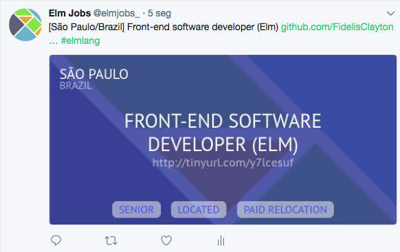

# Elm jobs
Discuss and post jobs for Elm. Publish the jobs via issue on Github.

See available jobs in: [https://github.com/FidelisClayton/elm-jobs/issues](https://github.com/FidelisClayton/elm-jobs/issues)

## Motivations and Inspirations
The elm lang slack already has a channel to post Elm jobs and already have some pinned, so, why do I've created this repository?

Some points:
- Slack pins doesn't have a good usability
- It's not easy to search and navigate by those pins
- Slack has a limited history (on free plan)
- Github issues are much easier to search, filter, manage and discuss.

This repository was inspired by [frontendbr/vagas](https://github.com/frontendbr/vagas/issues).

## Posting a job
Open a new **issue**, at the issue title put the city name and country between square brackets followed by the job title.
e.g: `[São Paulo/Brazil] Elm Front-End Developer`

Also, see [that example job](https://github.com/FidelisClayton/elm-jobs/issues/1).

Add the necessary labels to facilitate the search (required level, remote...).

## Follow us on Twitter 
All jobs shared here will automatically be posted on [@elmjobs_](https://twitter.com/elmjob).

## Important
1. If the job is not more available please close the issue to prevent new people applying.
2. Please follow the title guide line, this format is used on Twitter bot to generate the images of the tweets.
3. Add labels (`senior`, `located`, `freelancer`, etc) when creating a new issue, this also is used on Twitter bot.
